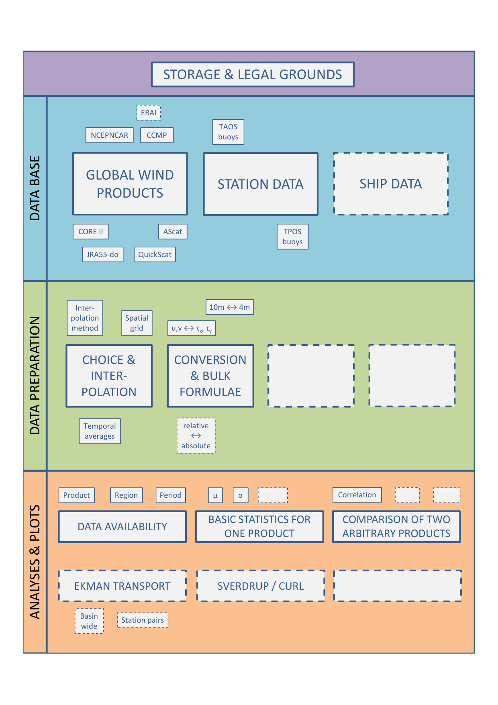

.. windeval documentation master file, created by
   sphinx-quickstart on Thu Aug 29 22:47:19 2019.
   You can adapt this file completely to your liking, but it should at least
   contain the root `toctree` directive.

Welcome to windeval's documentation
===================================

Compare wind prodocts.

Tool Structure
^^^^^^^^^^^^^^

Planned logic:

#. Load data using Intake_.
#. Central data type is the Xarray-Dataset_.
#. Process, analyse and manipulate data data with custom code mostly based on
   Numpy_ and Xarray_.
#. Plots may be summarized in reports.

.. _Intake: https://intake.readthedocs.io/en/latest/?badge=latest
.. _Numpy: https://numpy.org/
.. _Xarray: http://xarray.pydata.org/en/stable/
.. _Xarray-Dataset: http://xarray.pydata.org/en/stable/data-structures.html#dataset

.. toctree::
   :maxdepth: 2
   :caption: First Steps

   _source/introduction

.. toctree::
   :maxdepth: 2
   :caption: Modules

   _source/importer
   _source/wrapper
   _source/processing
   _source/analysis

.. toctree::
   :maxdepth: 2
   :caption: Contributing and Use

   _source/contributing
   _source/license

Indices and tables
==================

* :ref:`genindex`
* :ref:`modindex`
* :ref:`search`
